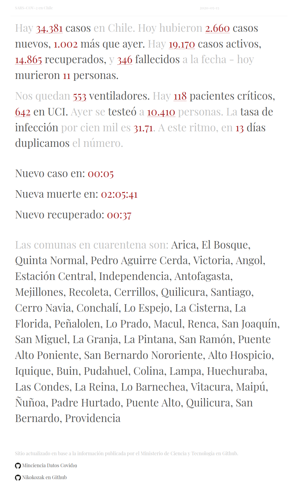

## Live Demo

(Chile - Covid Poem)[https://chile-covidpoem.onrender.com/]

## Covid-19 in Chile

A simple page rendering data from [Chile's Ministry of Science and
Technology](https://github.com/MinCiencia) in a text-based format. I get a bit overwhelmed by charts, and
wanted to make something cleaner, and hopefully somewhat more interesting than
the typical numerical-only counters. That said, charts are still available as
modals, simply click on the various underlined numbers to pull them up.

### Details

The site is written in vanilla JS, and uses a few lightweight libraries:

- **MicroModal** for modal functionality.
- **Chart.js** for chart rendering.
- **PapParser** for CSV parsing.
- **Axios** for http requests.
- **Bootstrap.css** for basic grid styling.
